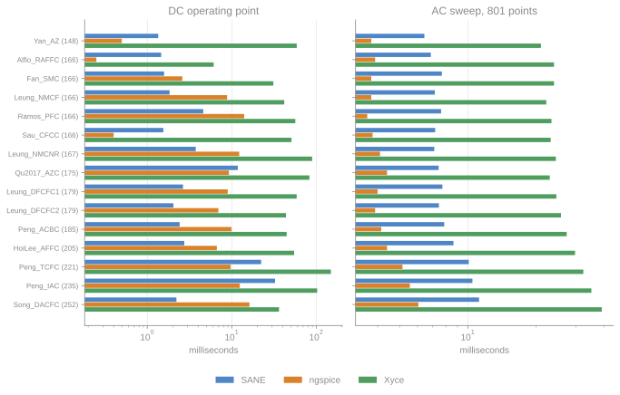
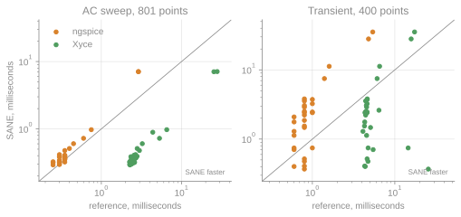
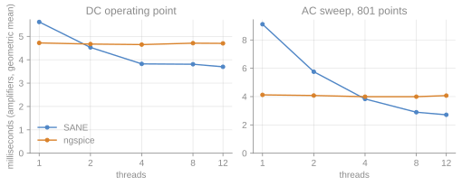

<p align="center">
  
</p>

# SANE

**Symbolic Analog Network Engine** — circuit analysis on a symbolic graph. A
Rust core (hash-consed symbolic DAG, autodiff, native sparse solver) with a
Python binding. No C backend.

SANE extracts the differential-algebraic system `I(x, t) + d/dt Q(x) = 0` from a
circuit and analyzes it: DC operating point, transient, small-signal AC, poles/zeros,
noise, harmonic balance, and exact parameter sensitivity (first and second order)
for each of those — all by automatic differentiation of one symbolic DAG.
Inspired by Analog Insydes (Fraunhofer ITWM).

## Installation

Built from source with [maturin](https://github.com/PyO3/maturin); not on PyPI.

```
maturin develop --release -m crates/py/Cargo.toml          # builds the `sane` module
```

The native backend for the hot tapes is on by default; add
`--no-default-features` for an interpreter-only build, or keep it and disable
it per run with `SANE_JIT=0`.

Rust embedding (no Python): `cargo add sane-analysis` as a path/git dependency
pulls in the whole engine.

## Quick start

```python
import numpy as np
import sane

model = sane.Circuit.parse("""
    V1 in 0 5
    R1 in out 1k
    C1 out 0 1u
""").extract()                        # or sane.Model.from_netlist(...)

op  = model.operating_point()         # DC bias, labeled by node
v   = op["out"]                       # 5.0

ss  = model.small_signal("V1", "out") # linearize at the bias
ss.poles()                            # [-1000.+0.j]  (the RC pole)
mag_db, phase_deg = ss.bode(np.logspace(1, 5, 50))

traj = model.transient(np.linspace(0, 5e-3, 200))
traj["out"]                           # time series at node "out"

sens = op.sensitivity("out")          # exact dy/dp for every parameter (one adjoint solve)
sens.ranked()                         # [(param, rel. sensitivity), ...] most important first
```

Results are labeled by node and parameter name — no positional vectors. A result
object keeps its solved state, so derived analyses (`op.sensitivity(...)`) need
no re-solve. Parameters are read/written hierarchically: `model.X1.R2 = 1e3`,
`model.set("X1.R2", 1e3)`, `model.get("X1.R2")`.

## Netlist format

The SPICE frontend parses comments, continuation lines, `.param` with
`{expressions}`, `.subckt`/`X` hierarchy, `.model` with parameter aliasing, and
HSPICE single-quoted geometry expressions. Source waveforms: `DC`, `AC`, `SIN`,
`PULSE`, `EXP`, `PWL`.

| Directive | Effect |
|---|---|
| `.param name=expr` | named parameter, usable in `{expr}` |
| `.model name type(...)` | model card; `type` is a built-in or a bound Verilog-A module |
| `.subckt` / `X` | subcircuit definition / instance (one shared function per body) |
| `.veriloga "file.va"` or inline `.veriloga ... .endveriloga` | load a Verilog-A module |
| `.model_alias level=N module` | bind a SPICE `level` to a Verilog-A module |
| `.temp` / `.option scale=...` | global temperature [°C] / drawn-to-meter scale |
| `.ic` / `.nodeset` | initial condition / DC symmetry-break hint |

### Devices

Every model is symbolic constitutive equations on the shared DAG, so Jacobians,
sensitivities, AC, harmonic balance, temperature and noise all come from the same
autodiff machinery.

| Netlist | Device | Model |
|---|---|---|
| `R` `C` `L` | resistor / capacitor / inductor | ideal linear; `R` carries `4kT/R` thermal noise |
| `K` | mutual inductance | coupling between two named inductors |
| `V` `I` | independent source | DC / AC plus `SIN` / `PULSE` / `EXP` / `PWL` waveforms |
| `E` `G` `F` `H` | controlled source | VCVS / VCCS / CCCS / CCVS |
| `B` | behavioral source | `V=` / `I=` expression: arithmetic, comparisons, `if(c,t,e)`, and `sin cos tan exp ln log sqrt sinh cosh tanh atan floor abs pow min max` (unknown function = parse error) |
| `S` `W` | controlled switch | smooth log-conductance window (`Vh`/`Ih`), hard threshold at `Vh=0`/`Ih=0`; the window edges are switching events the transient lands on |
| `D` | diode | exponential `Is(T)`, series `Rs`, junction + diffusion charge (`Cj0`/`TT`), reverse breakdown (`BV`), shot + flicker noise |
| `M` | MOSFET | level-1 square law + optional level-2/3 (body effect, DIBL, mobility), subthreshold, overlap/channel/bulk charge, thermal + flicker noise. `level>3` routes to a Verilog-A module via `.model_alias` |
| `Q` | BJT | Gummel-Poon: Early, high injection, leakage, series `Rb`/`Rc`/`Re`, junction + diffusion charge, shot + flicker noise |
| `J` | JFET | Shichman-Hodges; gate junctions + depletion charge |
| `Z` | MESFET | Statz / Raytheon (ngspice-compatible); gate junctions + depletion charge |
| `T` `O` `U` | transmission line | `T` exact lossless (Branin delay line); with `N=` (and for `O`/`U`) an N-segment lumped RLGC ladder |
| `N` | Verilog-A | compact models (BSIM / VBIC / PSP / EKV / HICUM / ...) compiled natively onto the DAG; parameter ranges enforced |

The nonlinear built-ins (`S`/`D`/`M`/`Q`/`J`/`Z`/`T` and the ideal transformer)
are themselves Verilog-A modules (`crates/veriloga/builtin/*.va`) and lower
through the same frontend as user compact models -- one device path, with the
template cache, instance batching, `$limit` collection and noise extraction
shared.

`$temp` [K] is a first-class symbolic global: thermal voltage `kT/q`, `Is(T)`
(with `Eg`/`XTI`), and mobility `~(T/Tnom)^-1.5` track it for `D`/`Q`/`M`/`J`/`Z`,
so `.temp` sweeps are physical and `d(metric)/dT` is exact. Noise sources (resistor
thermal, semiconductor shot/flicker, MOSFET channel-thermal, Verilog-A
`white_noise`/`flicker_noise`) are summed in one registry.

---

# Python API

`import sane`. The package exposes two classes — `Circuit` (build) and `Model`
(analyze) — plus labeled result objects. The Python layer
is a thin wrapper; orchestration, parameter store and analyses are in Rust
(`sane_analysis::Model`, raw handles at `sane._core`).

## Top-level functions

| Function | Returns | Purpose |
|---|---|---|
| `parse(netlist)` | `Circuit` | shorthand for `Circuit.parse` |
| `set_parallelism(threads)` | `None` | threads for the parallel work: the sweeps (AC/noise over frequency, HB device sampling) and, in every solve, the device instances of each evaluation: `n`=n, `0`=the default (4). Set it before the first analysis |
| `set_log_level(level="info")` | `None` | native logging: `"debug"`/`"info"`/`"warning"`/`"error"`/`"off"` |
| `profile_begin()` / `profile_take()` | `None` / `list[(stage, ms)]` | collect per-stage timings |
| `reduced_netlist(netlist, transforms)` | `str` | apply graph transforms, emit a smaller netlist |

Exported types: `Circuit`, `Model`, the result objects and `GROUND_ALIASES`
(`{"0","gnd","GND","Gnd","ground"}`).

## `Circuit`

Build from a netlist string or programmatically. Builder methods return `self`
for chaining. A node reference is a string name (or `0`/ground alias).

**Construction**
- `Circuit()` — empty circuit
- `Circuit.parse(netlist: str) -> Circuit` *(classmethod)* — parse a SPICE netlist
- `extract(fold=None, keep=None) -> Model` — lower to an analyzable `Model`;
  `fold` names parameters (or groups) to fold to their values, `keep` the only
  ones to keep symbolic

**Linear / controlled elements** — each returns `Circuit`
- `resistor(name, n1, n2, value=None)`
- `capacitor(name, n1, n2, value=None)`
- `inductor(name, n1, n2, value=None)`
- `voltage_source(name, n1, n2, dc=None)`
- `current_source(name, n1, n2, dc=None)`
- `vcvs(name, out_p, out_n, ctrl_p, ctrl_n, gain=None)` — voltage-controlled voltage source
- `vccs(name, out_p, out_n, ctrl_p, ctrl_n, gain=None)` — voltage-controlled current source
- `cccs(name, out_p, out_n, ctrl, gain=None)` — current-controlled current source
- `ccvs(name, out_p, out_n, ctrl, gain=None)` — current-controlled voltage source
- `mutual(name, l1, l2, k=None)` — couple two named inductors

**Nonlinear devices** — each returns `Circuit`; `**params` override model defaults
- `diode(name, anode, cathode, **params)`
- `mosfet(name, d, g, s, b=None, **params)` — bulk defaults to source
- `bjt(name, c, b, e, **params)`
- `vswitch(name, n1, n2, ctrl_p, ctrl_n, **params)`
- `cswitch(name, n1, n2, ctrl, **params)`

**Source waveforms** — attach to the most recently added source, return `Circuit`
- `sine(offset=0.0, amplitude=1.0, freq=None, omega=None)`
- `pulse(v1, v2, delay=0.0, rise=0.0, fall=0.0, width=0.0, period=0.0)`
- `exp(v1, v2, td1=0.0, tau1=0.0, td2=0.0, tau2=0.0)`
- `pwl(points)` — `points: list[(t, v)]`

**Introspection**
- `node_names: list[str]` — by internal node id (0 = ground)
- `values: dict[str, float]` — bound values by symbol name (`"R1"`, `"D1.Is"`)
- `elements: list[dict]` — `{"name","kind","nodes","control"}`
- `couplings: list[dict]` — `{"name","inductors"}`
- `device_count: int`

## `Model` — analyses

`Model.from_netlist(netlist) -> Model` is shorthand for
`Circuit.parse(netlist).extract()`.

Most analyses accept `values=None` (a `dict[str, float]` of per-call parameter
overrides) and `x0=None` (a starting state vector). Node/output references
resolve in order: unknown name → node name → source branch current.

| Method | Returns | Notes |
|---|---|---|
| `operating_point(values=None, x0=None, tol=1e-10, max_iter=100, nodeset=None, reltol=None, abstol=None, vntol=None)` | `OperatingPoint` | DC solve; `nodeset: dict[ref, V]` stiff-pins for symmetry breaking; per-component `reltol`/`abstol`/`vntol` |
| `transient(t, values=None, x0=None, rtol=1e-4, atol=1e-7, dt_max=None)` | `Trajectory` | ESDIRK32; `x0` defaults to the DC point; `dt_max` caps the adaptive step |
| `transient_events()` | `list[(name, t, dir)]` | the switching events of the last transient: surface `instance#k`, crossing time, `+1` rising / `-1` falling |
| `small_signal(input, output, values=None, x0=None)` | `SmallSignal` | linearize at the bias; poles/zeros/AC/sensitivity |
| `ac(input, output, freqs_hz, values=None, x0=None)` | `AcResponse` | AC response with the full derivative API |
| `harmonic_balance(f0=0.0, harmonics=8, values=None, x0=None, continuation=None, tol=1e-10, max_iter=60, oversample=16, samples=None)` | `HarmonicBalance` | periodic steady state; `f0<=0` infers from a `SIN` source |
| `noise(output, fstart, fstop, points=50, values=None, x0=None)` | `NoiseSpectrum` | output-referred PSD [V/√Hz] |
| `temp_sweep(output, tstart, tstop, points=50, values=None)` | `TempSweep` | output vs temperature [°C], warm-started |
| `state_space(input, output, values=None, x0=None)` | `StateSpace` | descriptor `(E, A, B, C, D)` at the OP |
| `model_reduce(input, output, order, fstart, fstop, points=50, values=None, x0=None)` | `ReducedModel` | dominant-pole MOR keeping `order` poles |
| `optimize(targets, tunables, iters=50, values=None)` | `Optimization` | Levenberg-Marquardt over exact sensitivities; `targets: dict[output, value]`, `tunables: list[str]` |

**Sensitivity** (exact, via autodiff — no finite differences)

| Method | Returns | Notes |
|---|---|---|
| `sensitivity(output, values=None, x0=None, t=0.0)` | `Sensitivity` | DC `dy/dp` over all parameters (one adjoint solve) |
| `hessian(output, wrt, values=None, x0=None, t=0.0)` | `ndarray` | exact second order over the `wrt` subset (dense symmetric) |
| `transient_sensitivity(params, t, rtol=1e-4, atol=1e-7, values=None)` | `dict[str, Trajectory]` | forward `dx(t)/dp` per parameter |
| `ac_sensitivity(input, param, output, freqs_hz, values=None, x0=None)` | `ndarray` | `dH/dp(f)` including the OP shift (complex per frequency) |
| `pole_sensitivity(input, param, values=None, x0=None)` | `list[(pole, dpole/dp)]` | exact `dλ/dp` |
| `zero_sensitivity(input, output, param, values=None, x0=None)` | `list[(zero, dzero/dp)]` | exact `dz/dp` |

## `Model` — parameters & introspection

**Parameters** (hierarchical, by name or path)
- `model.X1.R2` / `model["X1.R2"]` — read leaf value or a group proxy
- `model.X1.R2 = 1e3` / `model["X1.R2"] = 1e3` — write
- `get(name) -> float`, `set(name, value) -> None`
- `update(mapping=None, **kw) -> None` — bulk atomic set
- `reset() -> None` — restore construction defaults
- `name in model` / `len(model)` / `iter(model)` — membership / count / names

**Introspection** (properties)
- `unknowns: list[str]`, `dim: int`, `nnz: int`, `partition_sizes() -> (int, int) | None`
- `params: list[str]`, `values: dict[str, float]`
- `node_names: list[str]`
- `unknown_index(ref) -> int`, `unknown_name(ref) -> str`
- `transforms`, `eliminated`
- `core` *(raw `_core.Model`)*

## `Model` — transforms

**Transforms** (return a new `Model` on the same context)
- `linearize()` — small-signal linear DAE `G·dx + d/dt (C·dx) = 0`
- `reduce(rel_tol=1e-3, freqs=None, values=None, x0=None)` — OP-guided branch pruning; sets `.transforms`
- `eliminate(keep=None)` — exact resistive-node elimination; sets `.eliminated`
- `fold(*paths)` — bind parameters/groups to their current value (constant-fold, drop from the sensitivity set)
- `keep(*paths)` — fold every parameter except the named ones/groups (a few tuning knobs among many fixed device parameters)

## Result objects

All are labeled; `__getitem__(ref)` resolves a node/unknown/source name.

**`OperatingPoint`** — `vector: ndarray`, `unknowns`, `node_names`;
`op[ref] -> float`, `get(ref, default=None)`, `to_dict()`;
`sensitivity(output) -> Sensitivity`, `hessian(output, wrt) -> ndarray`.

**`Trajectory`** — `t: ndarray`, `matrix: ndarray (T,n)`, `unknowns`, `node_names`;
`traj[ref] -> ndarray`, `to_dict()`, `plot(*refs, ax=None, show=False)`;
`sensitivity(output, t=None, wrt=None, rtol=1e-4, atol=1e-7) -> Sensitivity`.

**`Sensitivity`** — `params`, `gradient: ndarray`, `output`;
`s[name] -> float`, `to_dict()`, `relative() -> ndarray`;
`ranked(relative=True, threshold=0.0) -> list[(param, value)]`;
`rollup(relative=True) -> list[(component, value)]` (L2-aggregated to device level).

**`SmallSignal`** — `G, C, B`, `unknowns`, `input_name`, `output`;
`poles() -> ndarray` [rad/s], `zeros() -> ndarray`,
`response(freqs_hz) -> ndarray` (complex `H`), `bode(freqs_hz) -> (mag_db, phase_deg)`,
`pole_sensitivity()`, `zero_sensitivity()` → `list[(value, Sensitivity)]`.

**`AcResponse`** — `freqs`, `value: ndarray` (complex `H`);
`sensitivity(f, metric="mag") -> Sensitivity` (metrics `"mag"`/`"phase"`/`"real"`/`"imag"`),
`hessian(f, wrt, metric="mag") -> ndarray`.

**`NoiseSpectrum`** — `freqs`, `noise: ndarray` [V/√Hz], `output`;
`sensitivity(f) -> Sensitivity` (gradient of the PSD), `integrated_rms() -> float` [V].

**`StateSpace`** — `states`, `E, A: (n,n)`, `B, C: (n,)`, `D: float`, `input`, `output`.
Model: `E·x' = A·x + B·u`, `y = C·x + D·u`.

**`TempSweep`** — `temps_c: ndarray`, `values: ndarray`, `output`.

**`Optimization`** — `tuned: dict`, `results: list[(output, target, achieved)]`,
`trace: ndarray` (RMS per iteration), `converged: bool`.

**`ReducedModel`** — `freqs`, `full_db`, `reduced_db`, `poles`, `zeros`,
`max_err_db: float`.

**`HarmonicBalance`** — `spectra: (n, K+1)`, `f0`, `harmonics`, `freqs`,
`converged`, `iters`, `residual_norm`, `setup_ms`, `solve_ms`;
`hb[ref] -> ndarray` (complex spectrum), `harmonic(ref, k) -> complex`,
`dc(ref) -> float`, `magnitude(ref)`, `phase(ref, deg=True)`, `thd(ref) -> float`,
`plot(*refs, db=False)`; `sensitivity(ref, k, metric="coeff") -> Sensitivity`,
`hessian(ref, k, wrt, metric="coeff") -> ndarray`.

---

## Verilog-A and PDK compact models

A Verilog-A module is loaded with `.veriloga "file.va"` (or inline) and
instantiated with an `N` element; its analog block is lowered onto the DAG, so
the device runs through every analysis like a built-in. The lowering supports
the analog subset (contributions, `ddt`/`idt`, `if`/`case`/`for`, analog
functions, `white_noise`/`flicker_noise`, `laplace_nd`); constructs that cannot
be lowered exactly (`transition`/`slew`, `laplace_zp`, ...) error at parse time.

**System tasks and diagnostics.** The dollar-diagnostic tasks are honored, not
dropped: `$error`/`$fatal` reached unconditionally (or under a parameter guard
that folds true for the instance) is a hard load failure carrying the message,
module and line; `$warning` and an unresolved `` `include `` become catchable
`SaneConvergenceWarning`s at parse/extract; a `$error` under a *runtime* guard
(which SANE's single analysis-agnostic model cannot enforce) becomes a load-time
warning that the assertion is unenforced rather than a silent no-op; a
non-finite compile-time constant baked into the residual always warns. Purely
textual tasks (`$strobe`, `$display`, `$write`, `$monitor`, `$debug`, `$fopen`/
`$fclose`/`$fwrite`, and `$finish` under a runtime guard) are ignored no-ops.

**Analog events.** `@(cross(expr, dir))` and `@(above(expr))` declare a
*switching surface* `expr = 0` (direction `0` either way, `+1` rising, `-1`
falling; `above` is rising). The transient integrator evaluates every declared
surface once per candidate step, locates a sign change on the step's dense
output and retakes the step to the crossing, so a hard mode change written as
an `if` or `?:` on the same comparison flips at a step boundary instead of
being discovered through rejected steps. The body of such an event must be
passive (empty, `$discontinuity`, `$bound_step`): an event body executes only
at the event instant, which needs a discrete state the one continuous model
does not carry, and a body with statements is rejected at load. `@(timer(...))`
and `@(final_step)` are rejected for the same reason. `@(initial_step)` /
`@(initial_model)` bodies run **unconditionally** as part of the assembled
residual (not gated to the first time step). This is exact for the common
precompute idiom — bias-independent constants derived from parameters — but a
stateful `@(initial_step)` block would not be gated to t=0. The events of the
most recent transient are reported by `Model.transient_events()` as
`(instance#k, t, direction)`.

**`idt` and guarded division.** `idt(u, ic)` mints a differential state with the
correct DC semantics, but the `ic` argument is **not** applied: SANE lowers one
DC/transient-shared DAE with no per-state initial-condition override, so the
transient always seeds from the DC operating point. A non-zero `ic` raises a
catchable `SaneConvergenceWarning` at load rather than being silently dropped.
Division inside a conditional arm is lowered with a sign-preserving magnitude
floor on the divisor, so an eagerly-evaluated not-taken branch (e.g. the `1/x`
in `if (x != 0) y = 1/x;` at `x = 0`) keeps both the residual and the Jacobian
finite; the taken arm is exact.

```python
ckt = sane.Circuit.parse("""
    .veriloga
    module diode(a, c);
      inout a, c; electrical a, c;
      parameter real Is = 1e-14;
      parameter real N  = 1.0;
      parameter real Vt = 0.025852;
      analog I(a, c) <+ Is * (limexp(V(a,c)/(N*Vt)) - 1.0);
    endmodule
    .endveriloga
    V1 1 0 0.7
    R1 1 2 1k
    N1 2 0 diode Is=2e-14
""")
op = ckt.extract().operating_point()   # solved by the native engine
```

**PDK level idiom.** Foundry PDKs ship devices as Verilog-A bound by a SPICE
`level` number. SANE has no built-in compiled compact models — the `.va` *is* the
model — so the level is bound explicitly:

```spice
.veriloga "pdk/bsim4.va"          ; module bsim4va
.model_alias level=54 bsim4va     ; bind the legacy level
.include "pdk/corners/tt.spice"   ; binned level=54 .model cards
M1 d g s b nch L=0.15u W=1u       ; routed to bsim4va; nmos/pmos -> type +/-1
```

The card's `nmos`/`pmos` token sets the module `type`, `.option scale` converts
drawn microns to meters, model binning picks the card by `L`/`W`, and `M`/`mult`/`nf`
set multiplicity. Device subcircuits (`X... sky130_fd_pr__nfet_01v8 l='...' w='...'`)
over binned cards are ingested natively, so a raw foundry netlist + corner parses
with no external flattener.

## Rust embedding

The analysis stack is pure Rust with the same labeled API the Python binding
wraps.

```rust
use sane_analysis::Model;

let model = Model::from_netlist("V1 in 0 5\nR1 in out 1k\nR2 out 0 1k\n.end")?;
let op = model.operating_point(&[])?;            // DC bias
let s  = op.sensitivity("out")?;                 // exact dy/dp over all parameters
model.set("R2", 3e3)?;
let traj = model.transient(&[], &t_eval, 1e-4, 1e-7)?;

let x = op.vector().to_vec();
let p = model.pvec(&[]);
let poles  = model.poles(x.clone(), p.clone())?;
let dpoles = model.pole_gradient(x, p)?;         // exact dpole/dp, all params
```

See `crates/analysis/tests/embed.rs` for a worked acceptance suite.

## Configuration and environment variables

Every run-time switch of the engine is a field of `sane_core::Config`, documented there. The
configuration is read from the environment once, on first use, and a host sets it directly
with `sane_core::set_config` or `update_config`. The variables below override the defaults for A/B
benchmarking and debugging; the log level (`SANE_LOG`) and the test-corpus locations
(`SANE_VA_CORPUS`, `SANE_OPENVAF_BIN`) are read where they are used.

| Variable | Effect |
|---|---|
| `SANE_THREADS` | threads, default 4 (see also `set_parallelism`): the sweeps' frequencies and HB samples, and in every solve the device instances of each evaluation; the linear solves themselves are sequential |
| `SANE_JIT` | `0` disables the native compilation of hot tapes (default on; build must have the `jit` feature) |
| `SANE_TAPE_SPEC` | `0` disables choice specialization of the circuit-level tapes |
| `SANE_TRAN_FIXED` | force a fixed transient step instead of adaptive |
| `SANE_EVENTS` | `0` disables locating the declared switching surfaces (the controller then finds every mode change through rejects; the A/B reference) |
| `SANE_LOG` | log level (`debug`/`info`/`warning`/`error`); the sparse solver's own records (rslab: ordering picked, fill, threads, factor time) appear at `debug` with an `rslab:` prefix, its warnings at `warning`, and rsdag's compile stages likewise with an `rsdag:` prefix |
| `SANE_DC_TRACE` | per-iteration DC Newton residual/step trace |
| `SANE_TRAN_TRACE` | per-candidate transient step trace: time, size, error, verdict, located events, stage Newton iterations |
| `SANE_VA_CORPUS` | path to a Verilog-A model corpus (for the corpus tests) |
| `SANE_VA_TRACE_NAN` | report non-finite compile-time constants during VA lowering |
| `SANE_VA_DEBUG_WHILE` | trace the unrolling scan of Verilog-A `while` loops |
| `SANE_NO_COLLAPSE` | lower every statically zero-volt Verilog-A branch as an explicit source with its own unknown instead of merging its nodes |
| `SANE_HB_BAND` | harmonic-balance Jacobian bandwidth `B` (harmonics k and l coupled only within B of each other); unset keeps the full blocks |
| `SANE_DUMP_MATRIX` | directory to write the assembled linear systems to, as Matrix Market (`sane_<n>_<k>.mtx`, right-hand side `sane_<n>_<k>_b.mtx`), real and complex alike |
| `SANE_DUMP_LIMIT` | how many systems `SANE_DUMP_MATRIX` writes, default 1 |

## Crates

| Crate | Purpose |
|---|---|
| `sane-core` | SANE's constants, configuration, logging, profiling and the lowering of named math calls; the graph itself is rsdag |
| `vendor/rsdag` | the expression graph, differentiation, tape, native backend and the sparse solve programs (vendored, see `vendor/rsdag/VENDOR.md`) |
| `sane-mna` | the circuit IR: elements, sources, couplings, index-2 topology checks |
| `sane-netlist` | SPICE parser (preprocessor, expressions, subckt hierarchy) |
| `sane-veriloga` | native Verilog-A frontend (parse → elaborate → lower to DAG); ships the built-in device models as Verilog-A source (`builtin/*.va`) |
| `sane-device` | the device contract (`lower_behavioral` → DAE fragment) and lowering support types |
| `sane-dae` | DAE assembly (currents and charges) and graph transforms |
| `sane-solve` | native sparse Newton DC + homotopy + ESDIRK32 transient |
| `sane-analysis` | high-level analyses (OP/transient/AC/sweeps/PZ/noise/MOR/opt) |
| `sane-py` | PyO3 binding |

## Performance

Against ngspice-41 and Xyce 7.10 on an AMD Ryzen 9 9900X (Windows 11), every
tool on one thread. SANE runs each analysis once untimed, then five times, and
records the best; ngspice the mean of 20 runs in one session, Xyce the best of
three solver run times. Every tool starts from the same node set and, in
transient, runs with the same step bound and relative tolerance (1e-4). The
tables are generated from the recorded results; times in milliseconds unless
noted.

### AnalogGym amplifiers

The fifteen SKY130 AnalogGym amplifiers (BSIM4): the operating point (OP) and
the AC sweep over 801 points.



<!-- bench:amplifiers -->
| Amplifier | Unknowns | OP SANE | OP ngspice | OP Xyce | AC SANE | AC ngspice | AC Xyce |
|---|---|---|---|---|---|---|---|
| Yan_AZ | 85 | 1.83 | 0.500 | 58.7 | 4.85 | 3.75 | 21.0 |
| Alfio_RAFFC | 94 | 2.08 | 0.250 | 6.10 | 5.80 | 3.90 | 24.0 |
| Fan_SMC | 94 | 2.25 | 2.60 | 31.0 | 5.59 | 3.75 | 24.0 |
| Leung_NMCF | 94 | 2.24 | 8.80 | 41.8 | 5.25 | 3.75 | 22.2 |
| Ramos_PFC | 94 | 5.58 | 14.0 | 56.4 | 5.48 | 3.60 | 23.4 |
| Sau_CFCC | 94 | 2.14 | 0.400 | 50.8 | 5.62 | 3.80 | 23.2 |
| Leung_NMCNR | 95 | 4.13 | 12.2 | 89.3 | 5.39 | 4.10 | 24.5 |
| Qu2017_AZC | 100 | 11.1 | 9.25 | 82.9 | 5.78 | 4.40 | 23.0 |
| Leung_DFCFC1 | 101 | 4.09 | 8.95 | 58.6 | 5.80 | 4.00 | 24.6 |
| Leung_DFCFC2 | 101 | 2.54 | 6.95 | 43.8 | 5.62 | 3.90 | 25.8 |
| Peng_ACBC | 104 | 3.02 | 9.90 | 44.6 | 5.97 | 4.15 | 27.3 |
| HoiLee_AFFC | 115 | 3.49 | 6.65 | 54.7 | 6.65 | 4.40 | 29.7 |
| Peng_TCFC | 125 | 20.8 | 9.70 | 149 | 7.84 | 5.15 | 32.3 |
| Peng_IAC | 133 | 34.5 | 12.4 | 102 | 8.09 | 5.55 | 35.1 |
| Song_DACFC | 141 | 2.87 | 16.2 | 36.2 | 8.65 | 6.05 | 39.0 |
| **geometric mean** |  | **4.22** | **4.76** | **50.4** | **6.07** | **4.23** | **26.2** |
<!-- /bench:amplifiers -->

### Textbook corpus

The textbook circuits up to the uA741: the AC sweep and the transient. Their
DC solves take microseconds, under ngspice's timer resolution.



<!-- bench:corpus -->
| Analysis | vs ngspice | faster on | vs Xyce | faster on |
|---|---|---|---|---|
| AC sweep, 801 points | 0.836x | 2 of 30 | 6.78x | 29 of 29 |
| Transient, 400 points | 0.426x | 6 of 30 | 2.66x | 25 of 29 |

Speed: the reference's time over SANE's, above 1 SANE is faster.

<details><summary>Every circuit, milliseconds</summary>

| Circuit | Unknowns | AC SANE | AC ngspice | AC Xyce | Tran SANE | Tran ngspice | Tran Xyce |
|---|---|---|---|---|---|---|---|
| diode_clipper | 3 | 0.324 | 0.350 | 2.27 | 3.03 | 0.800 | 4.30 |
| parallel_tank | 3 | 0.303 | 0.350 | 2.66 | 0.370 | 0.800 | 26.0 |
| rc_lowpass | 3 | 0.299 | 0.250 | 2.41 | 0.413 | 0.800 | 4.81 |
| rc_timeconst | 3 | 0.342 | 0.250 | 2.31 | 0.400 | 0.600 | 4.38 |
| voltage_divider | 3 | 0.310 | 0.300 | 2.40 | 1.35 | 0.600 | 4.21 |
| zener_regulator | 3 | 0.341 | 0.300 | 2.35 | 2.69 | 0.800 | 4.46 |
| bjt_current_mirror | 4 | 0.424 | 0.300 | 2.25 | 3.88 | 1.00 | 4.55 |
| bridge_rectifier | 4 | 0.378 | 0.350 | 2.44 | 4.04 | 0.800 | 4.52 |
| mesfet_cs | 4 | 0.359 | 0.250 | 2.55 | 2.55 | 0.800 | 4.40 |
| mos_current_mirror | 4 | 0.401 | 0.300 | 2.48 | 2.96 | 1.00 | 4.65 |
| nmos_curve | 4 | 0.361 | 0.350 | 2.48 | 2.79 | 0.800 | 4.44 |
| subckt_divider | 4 | 0.330 | 0.300 | 2.63 | 1.87 | 0.600 | 4.89 |
| zener_clipper | 4 | 0.329 | 0.300 | 2.58 | 2.57 | 1.00 | 4.71 |
| bjt_emitter_follower | 5 | 0.459 | 0.350 | 2.52 | 3.46 | 0.800 | 4.39 |
| cmos_inverter | 5 | 0.381 | 0.300 | 2.57 | 1.28 | 0.600 | 4.58 |
| jfet_cs | 5 | 0.362 | 0.350 | 2.80 | 0.780 | 0.600 | 5.30 |
| op_inverting | 5 | 0.391 | 0.300 | 2.68 | 1.60 | 0.800 | 4.44 |
| series_rlc | 5 | 0.391 | 0.350 | 2.67 | 0.480 | 0.800 | 4.78 |
| symcirc_simple_lc | 5 | 0.366 | 0.350 | 2.71 | 0.750 | 0.600 | 14.5 |
| colpitts_oscillator | 6 | 0.438 | 0.300 | 2.70 | 0.823 | 1.00 | 4.74 |
| sallen_key_lp | 6 | 0.389 | 0.350 | 2.74 | 0.513 | 0.800 | 4.63 |
| vswitch_divider | 6 | 0.397 | 0.350 | - | 2.56 | 0.600 | - |
| biased_clipper | 7 | 0.424 | 0.400 | 2.87 | 3.68 | 0.800 | 4.38 |
| cswitch_load | 7 | 0.409 | 0.350 | - | 1.97 | 0.800 | - |
| bjt_ce_min | 8 | 0.443 | 0.350 | 3.07 | 4.04 | 1.00 | 4.62 |
| symcirc_emitteramp | 10 | 0.545 | 0.450 | 3.33 | 1.53 | 0.800 | 5.07 |
| symcirc_mos_amp | 10 | 0.540 | - | - | 1.33 | - | - |
| cmos_diffpair_ota | 16 | 0.801 | 0.600 | 5.36 | 8.47 | 1.40 | 6.09 |
| symcirc_conrad2st | 16 | 0.807 | - | 4.46 | 2.71 | - | 6.55 |
| multistage_bjt_opamp | 21 | 1.01 | 0.750 | 6.68 | 14.8 | 1.60 | 6.45 |
| ua741_inverting | 105 | 4.32 | 2.90 | 25.7 | 24.0 | 4.80 | 16.1 |
| ua741 | 109 | 4.57 | 2.90 | 27.7 | 31.4 | 5.40 | 18.4 |

</details>
<!-- /bench:corpus -->

### Threads

SANE runs on 4 threads by default (`SANE_THREADS`, `set_parallelism`): in
every solve the device instances of each evaluation (the operating point,
the transient, harmonic balance), and the frequencies of AC and noise
sweeps. The results do not depend on the thread count. The amplifiers over
the thread count, geometric means; ngspice's OpenMP device load does not
change on circuits of this size.



<!-- bench:threads -->
| Threads | OP SANE | OP ngspice | AC SANE | AC ngspice |
|---|---|---|---|---|
| 1 | 4.28 | 4.67 | 6.02 | 4.04 |
| 2 | 2.93 | 4.91 | 4.02 | 4.06 |
| 4 | 2.48 | 4.69 | 2.92 | 4.06 |
| 8 | 2.79 | 4.58 | 2.37 | 4.02 |
| 12 | 2.78 | 4.67 | 2.36 | 4.02 |
<!-- /bench:threads -->

### VACASK transient suite

The transient cases of the [VACASK](https://codeberg.org/arpadbuermen/VACASK)
benchmark suite, the ring on the PSP103 Verilog-A model, with the step bound
of the upstream decks. SANE's time is the transient solve; ngspice's the whole
process on the upstream deck, as in VACASK's own methodology.

<!-- bench:vacask -->
| Case | Unknowns | Steps | SANE, s | ngspice, s |
|---|---|---|---|---|
| rc | 3 | 1,000,000 | 0.835 | 1.57 |
| graetz | 9 | 1,000,000 | 4.96 | 2.41 |
| mul | 11 | 500,000 | 3.24 | 1.30 |
| ring | 47 | 20,000 | 17.7 | 2.29 |
<!-- /bench:vacask -->

### Verilog-A against OpenVAF

SANE's Verilog-A compiler against OpenVAF-reloaded on the corpus models:
compile time, fresh process, best of three. Then the device evaluation per
Newton iteration on the nine-stage PSP103 ring, native code: SANE's own
compilation of the model, OpenVAF's code called alone with the flags an OSDI
host sets, and OpenVAF's OSDI library hosted in SANE.

<!-- bench:openvaf -->
| Model | SANE, s | OpenVAF, s |
|---|---|---|
| PSP103 | 0.070 | 2.43 |
| BSIM4 | 0.017 | 1.43 |
| VBIC 1.3 | 0.009 | 0.309 |
| HICUM L0 | 0.007 | 0.275 |
| EKV 2.6 | 0.007 | 0.182 |

| Ring, per Newton iteration | SANE, us | OpenVAF, us | OpenVAF in SANE, us |
|---|---|---|---|
| operating point | 11.3 | 15.0 | 16.4 |
| transient | 12.4 | 15.6 | 16.6 |
<!-- /bench:openvaf -->

### Harmonic balance against Xyce

Diode circuits up to a 512-stage ladder, eight harmonics: SANE's solve
against Xyce's solver run time, and the largest relative difference of the
first three harmonics.

<!-- bench:hb -->
| Circuit | Harmonics | SANE, ms | Xyce, ms | Largest difference, H1-H3 |
|---|---|---|---|---|
| biased_diode_rc | 8 | 0.773 | 10.2 | 2.4e-04 |
| diode_mixer_bias | 8 | 0.748 | 10.9 | 1.9e-04 |
| diode_ladder_16 | 8 | 4.46 | 14.4 | 1.5e-04 |
| diode_ladder_64 | 8 | 16.8 | 35.0 | 1.5e-04 |
| diode_ladder_256 | 8 | 67.5 | 119 | 1.5e-04 |
| diode_ladder_512 | 8 | 137 | 228 | 1.5e-04 |
<!-- /bench:hb -->

## Validation

The numeric path is cross-validated against **ngspice** and **Xyce**:

- DC vs ngspice: 29/32 decks.
- BSIM4 DC + AC vs ngspice + OSDI: 12/12 SKY130 AnalogGym op-amps, relative error 1e-6..1e-4.
- Harmonic balance vs Xyce: the differences in the table above.
- Exact sensitivity (DC/AC/pole/transient, first and second order) vs finite-difference oracles (`crates/py/tests/`).
- Devices: the built-in models (diode, MOSFET, BJT, JFET, MESFET, switches, transformer, transmission line) are themselves Verilog-A (`crates/veriloga/builtin/`), lowered through the same pipeline as user compact models; closed-form physics checks in `crates/veriloga/tests/builtin_devices.rs`.
- Verilog-A corpus (OpenVAF `integration_tests`, via `SANE_VA_CORPUS`): 19/20 models — BSIM3/4/6/BULK/CMG/IMG/SOI, PSP102/103, MEXTRAM, HICUM, EKV, ASMHEMT, HiSIM family — parse, elaborate and lower; the one exception (HiSIM2) uses an unbounded `while` the analog subset rejects. PSP103 runs the VACASK transient suite, the nine-stage ring and the c6288 multiplier.

```
cargo test --workspace                      # Rust tests
maturin develop -m crates/py/Cargo.toml     # Python module `sane`
```

The native backend (residual, Jacobian and device bodies emitted as machine
code by rsdag, see `vendor/rsdag`) is the `jit` build feature, on by default;
numeric results are identical to the interpreter. `SANE_JIT=0` disables it at
runtime.

The linear systems are solved by the vendored rslab (`vendor/rslab`): KLU for
circuit-shaped patterns, supernodal LDLT for large systems whose values are
symmetric, supernodal LU for large unsymmetric ones. A Newton loop analyzes
its pattern once, refactors each iteration into the previous factor and solves
in scratch it keeps; KLU's numeric-only refactor replays the pivot sequence of
the first factorization and pivots afresh when a pivot vanishes.

## License

SANE is source-available under the [PolyForm Noncommercial License 1.0.0](LICENSE):
free for noncommercial use, that is research, evaluation, education, and
academia. Commercial use requires a separate license, see
[COMMERCIAL.md](COMMERCIAL.md) or contact info@milanrother.com.

The vendored trees under `vendor/` carry their own upstream licenses, and each
one is redistributed here as part of SANE under the license above:

| Tree | Upstream | Upstream license |
|---|---|---|
| `vendor/rsdag` | [rsdag](https://github.com/milanofthe/rsdag) | AGPL-3.0-only, same author, also licensed on other terms (see its `NOTICE`) |
| `vendor/rslab` | [rslab](https://github.com/milanofthe/rslab) | MIT |
| `vendor/vectfit` | [rapidmom](https://github.com/milanofthe/rapidmom) | PolyForm Noncommercial 1.0.0 |
